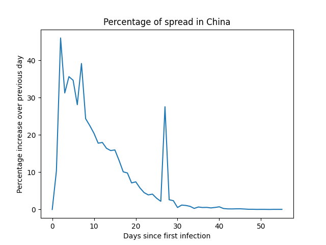

Playing around with some coronavirus data from [ourworldindata](https://ourworldindata.org/coronavirus)

Build with `docker-compose build app`

Run with `docker-compose run app python app.py "China"`

Will print a table like
```
+---------+-------+---------------------+
| Days in | Cases | Percentage Increase |
+---------+-------+---------------------+
|    0    |  278  |         0.0         |
|    1    |  310  |        10.323       |
|    2    |  574  |        45.993       |
|    3    |  835  |        31.257       |
|    4    |  1297 |        35.621       |
|    5    |  1985 |        34.66        |
```

showing percent increate by day.

Will also genertate a plot as a png file like 

