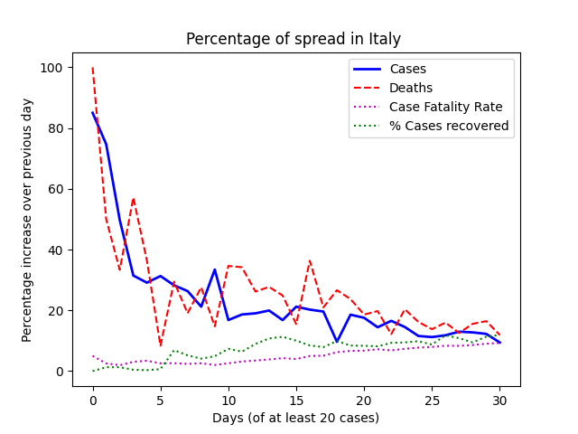
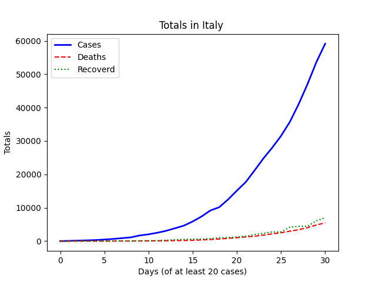

Playing around with some coronavirus data from [ourworldindata](https://ourworldindata.org/coronavirus)

Build with `docker-compose build app`

In order to get the data you will need to run `docker-compose run app python import.py`. The data is from [ncov.bii.virginia.edu](http://ncov.bii.virginia.edu/dashboard). They have a lot more information on their website. I only did this beacuse I wanted to plot the percentages of increase.

Run with `docker-compose run app python app.py`

Will defualt to USA. You can run for other countries by passing them as a paramiter.

Run with `docker-compose run app python app.py "Mainland China"`

Will print a table like
```
+------------+-------+-----------+--------+------------+-----------+---------------+
|    Date    | Cases | Cases % ^ | Deaths | Deaths % ^ | Recovered | Recovered % ^ |
+------------+-------+-----------+--------+------------+-----------+---------------+
| 01-22-2020 |  547  |     0     |   0    |     0      |     0     |       0       |
| 01-23-2020 |  639  |   14.397  |   18   |   100.0    |     30    |     100.0     |
| 01-24-2020 |  916  |   30.24   |   26   |   30.769   |     36    |     16.667    |
| 01-25-2020 |  1979 |   53.714  |   56   |   53.571   |     49    |     26.531    |
| 01-26-2020 |  2737 |   27.695  |   80   |    30.0    |     51    |     3.922     |
| 01-27-2020 |  4409 |   37.922  |  106   |   24.528   |     60    |      15.0     |
| 01-28-2020 |  5970 |   26.147  |  132   |   19.697   |    104    |     42.308    |
| 01-29-2020 |  7678 |   22.245  |  170   |   22.353   |    127    |     18.11     |
| 01-30-2020 |  9658 |   20.501  |  213   |   20.188   |    179    |     29.05     |
| 01-31-2020 |  9783 |   1.278   |  213   |    0.0     |    214    |     16.355    |
| 02-01-2020 | 14375 |   31.944  |  304   |   29.934   |    331    |     35.347    |
| 02-02-2020 | 17114 |   16.004  |  361   |   15.789   |    478    |     30.753    |
| 02-03-2020 | 20400 |   16.108  |  425   |   15.059   |    635    |     24.724    |
| 02-04-2020 | 24290 |   16.015  |  490   |   13.265   |    890    |     28.652    |
| 02-05-2020 | 24405 |   0.471   |  492   |   0.407    |    1020   |     12.745    |
| 02-06-2020 | 28165 |   13.35   |  565   |   12.92    |    1351   |      24.5     |
| 02-07-2020 | 31215 |   9.771   |  636   |   11.164   |    1750   |      22.8     |
| 02-08-2020 | 35051 |   10.944  |  730   |   12.877   |    2353   |     25.627    |
| 02-09-2020 | 40160 |   12.722  |  908   |   19.604   |    3286   |     28.393    |
| 02-10-2020 | 42310 |   5.082   |  1011  |   10.188   |    3921   |     16.195    |
| 02-11-2020 | 44641 |   5.222   |  1113  |   9.164    |    4730   |     17.104    |
| 02-12-2020 | 59805 |   25.356  |  1366  |   18.521   |    5915   |     20.034    |
| 02-13-2020 | 63841 |   6.322   |  1380  |   1.014    |    6713   |     11.887    |
| 02-14-2020 | 66482 |   3.973   |  1522  |    9.33    |    8105   |     17.175    |
| 02-15-2020 | 68500 |   2.946   |  1665  |   8.589    |    9454   |     14.269    |
| 02-16-2020 | 70550 |   2.906   |  1770  |   5.932    |   10879   |     13.099    |
| 02-17-2020 | 72438 |   2.606   |  1868  |   5.246    |   12621   |     13.802    |
| 02-18-2020 | 74185 |   2.355   |  2004  |   6.786    |   14420   |     12.476    |
| 02-19-2020 | 74576 |   0.524   |  2118  |   5.382    |   16232   |     11.163    |
| 02-20-2020 | 75465 |   1.178   |  2236  |   5.277    |   18346   |     11.523    |
| 02-21-2020 | 76290 |   1.081   |  2345  |   4.648    |   20731   |     11.505    |
| 02-22-2020 | 76936 |    0.84   |  2442  |   3.972    |   22917   |     9.539     |
| 02-23-2020 | 77150 |   0.277   |  2592  |   5.787    |   24779   |     7.514     |
| 02-24-2020 | 77658 |   0.654   |  2663  |   2.666    |   27359   |      9.43     |
| 02-25-2020 | 78064 |    0.52   |  2715  |   1.915    |   29783   |     8.139     |
| 02-26-2020 | 78487 |   0.539   |  2743  |   1.021    |   32534   |     8.456     |
| 02-27-2020 | 78824 |   0.428   |  2788  |   1.614    |   36141   |      9.98     |
| 02-28-2020 | 79250 |   0.538   |  2834  |   1.623    |   39012   |     7.359     |
| 02-29-2020 | 79822 |   0.717   |  2870  |   1.254    |   41640   |     6.311     |
| 03-01-2020 | 80026 |   0.255   |  2912  |   1.442    |   44502   |     6.431     |
| 03-02-2020 | 80151 |   0.156   |  2943  |   1.053    |   47190   |     5.696     |
| 03-03-2020 | 80267 |   0.145   |  2981  |   1.275    |   49865   |     5.364     |
| 03-04-2020 | 80409 |   0.177   |  3012  |   1.029    |   51961   |     4.034     |
| 03-05-2020 | 80552 |   0.178   |  3042  |   0.986    |   53714   |     3.264     |
| 03-06-2020 | 80651 |   0.123   |  3070  |   0.912    |   55392   |     3.029     |
| 03-07-2020 | 80695 |   0.055   |  3097  |   0.872    |   56940   |     2.719     |
| 03-08-2020 | 80735 |    0.05   |  3118  |   0.674    |   58543   |     2.738     |
| 03-09-2020 | 80754 |   0.024   |  3136  |   0.574    |   59888   |     2.246     |
| 03-10-2020 | 80777 |   0.028   |  3158  |   0.697    |   61464   |     2.564     |
| 03-11-2020 | 80783 |   0.007   |  3158  |    0.0     |   61496   |     0.052     |
| 03-12-2020 | 80796 |   0.016   |  3169  |   0.347    |   62846   |     2.148     |
| 03-13-2020 | 80812 |    0.02   |  3188  |   0.596    |   65501   |     4.053     |
| 03-14-2020 | 80844 |    0.04   |  3199  |   0.344    |   66901   |     2.093     |
| 03-15-2020 | 80858 |   0.017   |  3213  |   0.436    |   67738   |     1.236     |
| 03-16-2020 | 80881 |   0.028   |  3225  |   0.372    |   68669   |     1.356     |
| 03-17-2020 | 80881 |    0.0    |  3225  |    0.0     |   68669   |      0.0      |
| 03-18-2020 | 80928 |   0.058   |  3244  |   0.586    |   70410   |     2.473     |
| 03-19-2020 | 80928 |    0.0    |  3244  |    0.0     |   70410   |      0.0      |
+------------+-------+-----------+--------+------------+-----------+---------------+
```

Showing percent increase by day.

Will also genertate a plot as a png file like 


